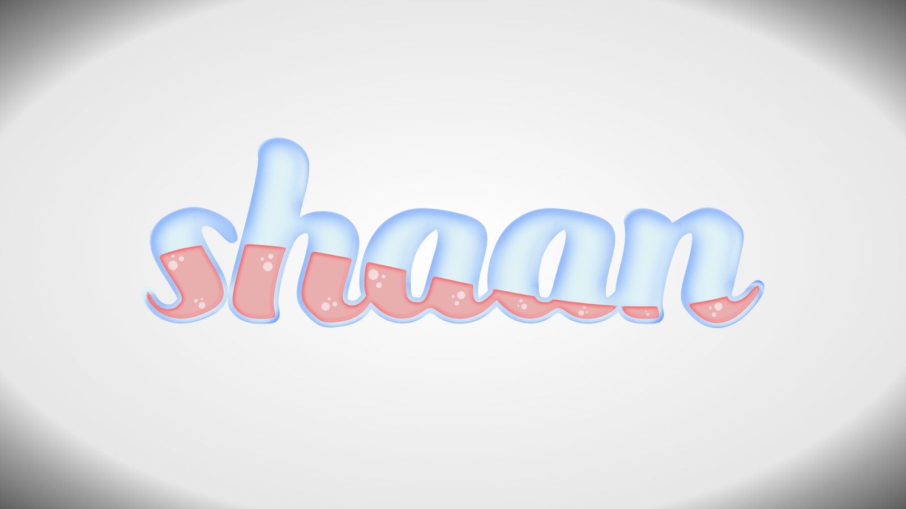
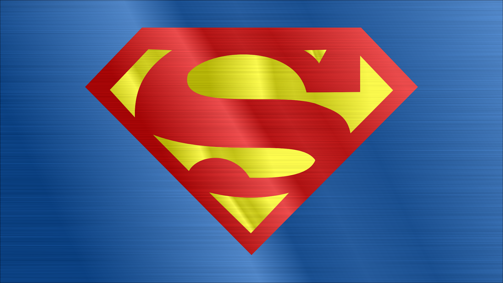

# Shaan Patel Design & Animation Portfolio

---

## 3D Animation

3D medieval-themed animation rendered using Blender and composited with Adobe Premiere Pro for 2021-22 Georgia Tech Ramblin' Raas set

<iframe width="560" height="315" src="https://www.youtube.com/embed/rcvkA5g83Gw" title="GTRR Medieval Cave Intro" frameborder="0" allow="accelerometer; autoplay; clipboard-write; encrypted-media; gyroscope; picture-in-picture" allowfullscreen></iframe>

---

### 3D Logo Animation

3D logo animation rendered using Blender and composited with Adobe Premiere Pro for Georgia Tech Ramblin' Raas Team

<iframe width="560" height="315" src="https://www.youtube.com/embed/dciWe07h1lU" title="GTRRLogoIntro" frameborder="0" allow="accelerometer; autoplay; clipboard-write; encrypted-media; gyroscope; picture-in-picture" allowfullscreen></iframe>

---

#### Blender Cycles for Plant the Moon Challenge

Research presentation video for annual Plant the Moon Challenge. Rendered 3D rocket footage in Blender Cycles, created information graphics in Canva, designed custom logo in Adobe Illustrator and Inkscape, and composited footage in Adobe Premiere Pro.

<iframe width="560" height="315" src="https://www.youtube.com/embed/KyAGe81oZ-o" title="Final PTMC Video1.3" frameborder="0" allow="accelerometer; autoplay; clipboard-write; encrypted-media; gyroscope; picture-in-picture" allowfullscreen></iframe>

---

#### Rendering with Blender Cycles engine

First attempt at rendering a full animation with full procedural textures. Rendered using Blender Cycles engine.

<iframe width="560" height="315" src="https://www.youtube.com/embed/gqqmBy4mpbA" title="Audi Night Render First Attempt" frameborder="0" allow="accelerometer; autoplay; clipboard-write; encrypted-media; gyroscope; picture-in-picture" allowfullscreen></iframe>

---

#### Blender Eevee

3D animation for promotional video of filament printed skateboard protectors. Rendered using traditional tri-point colored lighting setup in Blender Eevee.

<iframe width="560" height="315" src="https://www.youtube.com/embed/QMTbAR0lh00" title="Skateboard Protector Animated Promo" frameborder="0" allow="accelerometer; autoplay; clipboard-write; encrypted-media; gyroscope; picture-in-picture" allowfullscreen></iframe>

---

#### Low Poly

Low poly lighthouse animation using Blender with moving waves. Rendered in Blender Cycles.

<iframe width="560" height="315" src="https://www.youtube.com/embed/d1lLxWKWCDo" title="Low Poly Lighthouse Render" frameborder="0" allow="accelerometer; autoplay; clipboard-write; encrypted-media; gyroscope; picture-in-picture" allowfullscreen></iframe>

---

#### Lighting Shadows

Render test of lighting shadows for upcoming underwater sequence. Custom made by altering the Voronoi present in Blender and changing distortion and evolution levels.

<iframe width="561" height="315" src="https://www.youtube.com/embed/YNA_-XpOnXo" title="Procedural Voronoi Light Source Water Shadow Caster Test" frameborder="0" allow="accelerometer; autoplay; clipboard-write; encrypted-media; gyroscope; picture-in-picture" allowfullscreen></iframe>

---

## Video Composition, 2D Animation, and Visual Effects

### Adobe After Effects

Using Adobe After Effects to animate an introduction sequence for dance competition

<iframe width="560" height="315" src="https://www.youtube.com/embed/VQMv1U2JWqg" title="Shaan Dhoom Dynasty Dance Round 2" frameborder="0" allow="accelerometer; autoplay; clipboard-write; encrypted-media; gyroscope; picture-in-picture" allowfullscreen></iframe>

---

### Adobe After Effects and Adobe Premiere Pro

VFX Project using Adobe After Effects and Adobe Premiere Pro to create a motion tracking mask on moving wheels while compositing moving footage on top of the base footage.

<iframe width="560" height="315" src="https://www.youtube.com/embed/GJv-U65XNjk" title="Hoverboard VFX Experiment" frameborder="0" allow="accelerometer; autoplay; clipboard-write; encrypted-media; gyroscope; picture-in-picture" allowfullscreen></iframe>

---

## SVG Images

Created using Inkscape Vector Graphics Editor

### Designs using my first name

These were just some fun designs to help learn the program

---

#### Graffiti

I first started off learning vector designs using my name:

---

#### Glitch Effect

Glitch effect with my name. First time using boolean operations with vectors to make interesting designs.

---

#### Wood Carving

Carved wood effect generated by adding Gaussian blur to text and adding layer masks to images.

---

#### Liquid Text

Liquid text style created using a combination of skills learned previously like boolean operations, layer masks, and blurs along with new skills like vignette.

---

#### Neon Text

Neon text effect created with multiple layers, each with different amounts of blur and different saturations to give the illusion of light emitting onto the background.

---

### More Practice with basic vectorization and simple designs

---

#### Cartoon Styling

Recreated the popular Superman emblem using bezier curves and paths

---

#### Batman Vector Diagram

Following the same technique as the Superman emblem, I recreated the Batman vector image, but only made half of the design and mirrored it as a means of improving workflow.

---

#### Text Path Manipulation

Worked with modifying text paths to create shapes. In this case, I streched and modified the word "Rhino" into the shape of the animal.

---

#### Vectorizing A Picture of a falcon

Began using skills I had been developing to vectorize a picture of a falcon.

|               | Image        |
| ------------- |:-------------|
|Original       | |
|Vectorized     | |

---

#### Shadows

Decided to work with basic shadows by making this mountain landscape below.

---

### Experiementation with realistic materials and shadings

---

Created a personal logo for use on USB drives

---

Created a realistic eyeball using highlights and shadows based on an online tutorial.

---

#### Vectorized Donut

Followed an online tutorial to create a realistic vector donut.

---

#### Metallics

Followed and modified an online tutorial to generate a metallic Flash emblem

---

#### Metallics Part II

Used a previous vector design and metallic texturing skills to create a metallic Superman emblem

---