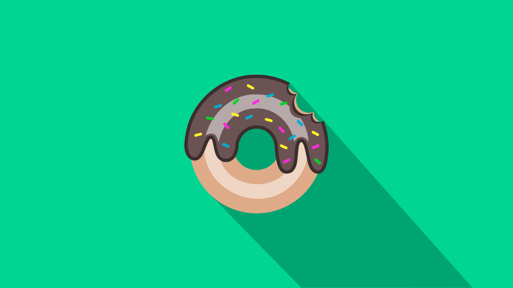

# Shaan Patel College Portfolio

## SVG Images

Created using Inkscape Vector Graphics Editor

###### Using my first name for some fun designs to help learn the program

1. This was my very first vector design made by following an online tutorial:

2. Glitch effect with my name. First time using boolean operations with vectors to make interesting designs.

3. Carved wood effect generated by adding Gaussian blur to text and adding layer masks to images.

4. Liquid text style created using a combination of skills learned previously like boolean operations, layer masks, and blurs along with new skills like vignette.

5. Neon text effect created with multiple layers, each with different amounts of blur and different saturations to give the illusion of light emitting onto the background.

###### More Practice with basic vectorization and simple designs

1. Recreated the popular Superman emblem using bezier curves and paths

2. Following the same technique as the Superman emblem, I recreated the Batman vector image, but only made half of the design and mirrored it as a means of improving workflow.

3. Worked with modifying text paths to create shapes. In this case, I streched and modified the word "Rhino" into the shape of the animal.

4. Began using skills I had been developing to vectorize a picture of a falcon.

5. Decided to work with basic shadows by making this mountain landscape below.

###### Experiementation with realistic materials and shadings

1. Created a personal logo for use on USB drives

2. Created a realistic eyeball using highlights and shadows based on an online tutorial.

3. Followed an online tutorial to create a realistic vector donut.

4. Followed and modified an online tutorial to generate a metallic Flash emblem

5. Used a previous vector design and metallic texturing skills to create a metallic Superman emblem

